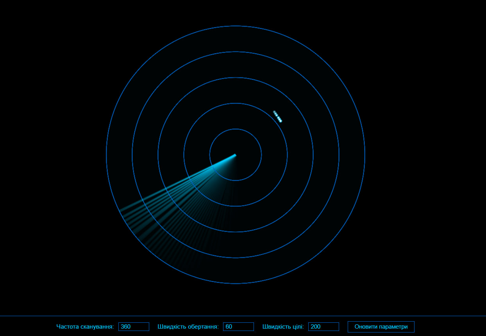
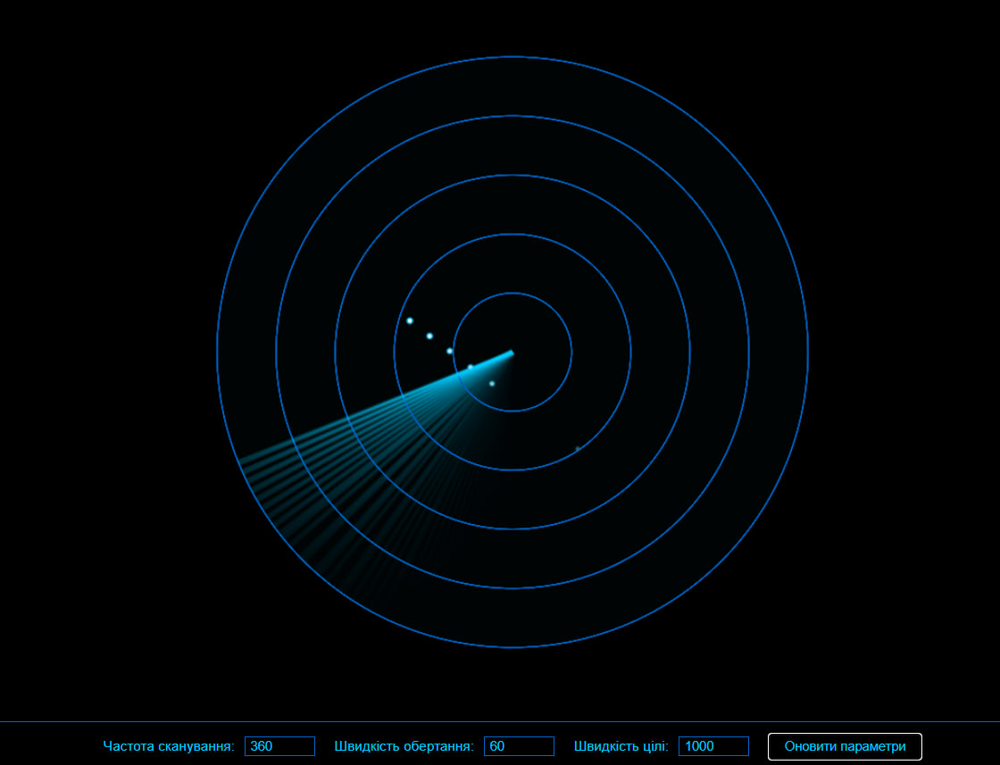
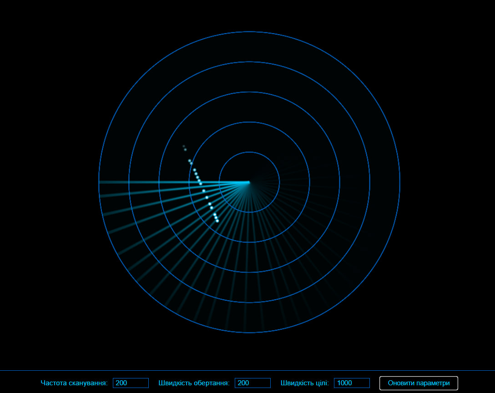

# Лабораторна робота №4: Розробка додатку для візуалізації вимірювань радару

## Посилання

[Демонстрація роботи системи на CodePen](https://codepen.io/VolodimirProdan/full/XJrKoOq)

## Мета роботи
Розробити програмний додаток для візуалізації роботи радарної системи з можливістю налаштування параметрів сканування та відстеження об'єктів.

## Хід роботи

### 1. Запуск та інтерфейс програми
Програма представляє собою візуальний симулятор радарної системи з можливістю налаштування трьох основних параметрів:
- Частота сканування (кількість сканувань)
- Швидкість обертання (обертів на хвилину)
- Швидкість цілі (умовні одиниці)

Інтерфейс програми розроблено з використанням сучасних технологій візуалізації та забезпечує інтуїтивно зрозуміле керування всіма параметрами системи:

  
   
  <em>Рис. 1 - Демонстрація роботи радару з базовими параметрами: частота сканування 360, швидкість обертання 60, швидкість цілі 200</em>

### 2. Відстеження швидких об'єктів
При збільшенні швидкості цілі можна спостерігати зміну характеру її відображення на радарі. Швидкі об'єкти залишають більш розріджений слід через більшу відстань між точками виявлення:

  
   
  <em>Рис. 2 - Візуалізація руху об'єкта зі збільшеною швидкістю до 1000 умовних одиниць</em>

### 3. Експерименти з частотою сканування та швидкістю обертання
При зменшенні частоти сканування до 200 та збільшенні швидкості обертання до 200 обертів на хвилину спостерігаються цікаві ефекти:

- Радар виконує більше повних обертів за одиницю часу
- Зменшення кількості точок сканування призводить до того, що іноді ціль не потрапляє в промінь радару
- Незважаючи на можливі пропуски, система все одно формує достатньо інформативну картину руху об'єкта
- Збільшення швидкості обертання компенсує меншу частоту сканування за рахунок більш частого "прочісування" простору

  
   
  <em>Рис. 3 - Результат оптимізації параметрів сканування для більш ефективного відстеження цілі</em>

## Висновки

У ході виконання лабораторної роботи було успішно розроблено систему візуалізації радарних вимірювань з наступними можливостями:

1. Налаштування основних параметрів роботи радарної системи в реальному часі
2. Візуалізація руху об'єктів різної швидкості
3. Оптимізація параметрів сканування для підвищення ефективності відстеження

Практичні експерименти показали, що:
- Збільшення частоти сканування покращує точність відстеження швидких об'єктів
- Швидкість обертання радару критично впливає на якість отримуваних даних
- Система здатна ефективно відстежувати об'єкти при правильному налаштуванні параметрів

